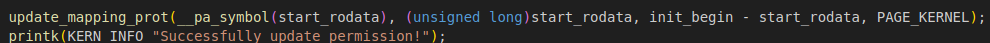
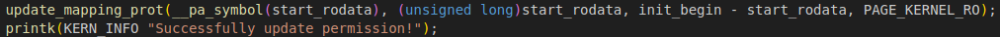
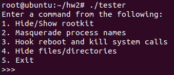

# Assignment 2

## Source code - rootkit.c
- Hide/Unhide module
    - Declare a global variable `hidden` to record whether the module is hidden or not. If it is hidden, show it. Otherwise, hide it.
    - Declare a global variable `prev_module` to record the pointer to the previous module in the list, which is used to remind us where to re-insert the rootkit module to the module list.
    - If it is to hide the module, then `list_del(&THIS_MODULE->list)` to delete the entry of rookit module from the list.
    - If it is to show the module, then `list_add(&THIS_MODULE->list, prev_module)` to re-insert the entry of rookit module to the correct location in the list.

- Masquerade process name
    - Declare a `struct masq_proc_req`-type variable `req_list` to store the input. The space it needs is allocated by `kzalloc`.
    - In the masquerade part in `rootkit_ioctl`, it will 
        1. `kzalloc` the space for req_list.
        2. copy the input using `copy_from_user` to know the length and `kzalloc` enough space for the process names with type `masq_proc`.
        3. use `copy_from_user` to copy all the input into kernel memory in a for loop.
    - Call `masq_proc_rootkit(req_list)` to masquerade process names.
        - Use a for loop along with a `for_each_task` to traverse req_list, checking which process is supposed to be masqueraded.
        - To masquerade a process name, copy the new name to `task_comm` by `strncpy(task->comm, proc->new_name, new_name_len);` and append a `'\0'` to it.
- Hook/Unhook syscall

    > In this part, I have difficulty dealing with `sys_call_table`. Therefore, I failed to finish all these three. In spite of the fact, I will still go through how I implement the syscall hooking.
    - To hook a system call, the SOP is
        1. Use kprobe to search for `kallsyms_lookup_name`.
            - Referencing the solution in [ref 2](https://stackoverflow.com/questions/70930059/proper-way-of-getting-the-address-of-non-exported-kernel-symbols-in-a-linux-kern), I use the same code segment to declare a `struct kprobe` variable.
        2. Use the function `kallsyms_lookup_name` to find the address of `sys_call_table` to locate the system calls.
            - Referencing the solution in [ref 2](https://stackoverflow.com/questions/70930059/proper-way-of-getting-the-address-of-non-exported-kernel-symbols-in-a-linux-kern), I typedef `kallsyms_lookup_name_t`.
        3. Use `update_mapping_prot` to change write permission of the memory segment (from `__start_rodata` to `__init_begin`).
        
        4. Hook the system calls by changing the value (pointer to the system call function) in `sys_call_table`.
        5. Update the permission back to read-only.
        
        
        P.S. I follow the way in [ref 3](https://blog.csdn.net/weixin_45030965/article/details/129203081) to do 3. 4. 5.
    - reboot

        Besides hooking `__NR_reboot` by the SOP, the hooked reboot `my_sys_reboot` also check if the `cmd` argument is equal to `LINUX_REBOOT_CMD_POWER_OFF`. If it is, then forbid it. Otherwise, call the original sys_reboot `orig_reboot`.

    - kill

        Besides hooking `__NR_kill` by the SOP, the hooked kill `my_sys_kill` also check if the `sig` argument is equal to `SIGKILL`. If it is, then forbid it and return 0.

    - getdents64

        Besides hooking `__NR_getdents64` by the SOP, the hooked getdents64 `my_sys_getdents64` do the following:
        1. Call the original syscall `orig_getdents64` with the dirent buffer `my_sys_getdents64` receives to have it populated with dirent structs.
        2. Allocate a kernel buffer of the correct size using `kmalloc` to store the orignal syscall output.
        3. Copy the content in `dirent` into kernel buffer `kernel_dirent` using `copy_from_user`.
        4. Use a for loop to check all dirent in `kernel_dirent`. If the target is found and it is the first entry, then `memmove` the rest entries by `cur_dirent->d_reclen`. If it is not the first one, just "ignore" it by `prev_dirent->d_reclen += cur_dirent->d_reclen;`.
        5. Copy the content in `kernel_dirent` into `dirent` with `copy_to_user`

## Test - tester.c
> Please compile this in the linux kernel VM by the following command:    
```bash
make test
```
By executing the tester executable, you will see something like the image below. You can choose an operation by typing number 1 ~ 5.
After choosing an operation, the respective ioctl will be called and you can test the effect by typing whatever relative command in bash (not in this process).


## Reference
- [ref 1](https://github.com/xcellerator/linux_kernel_hacking)
- [ref 2](https://stackoverflow.com/questions/70930059/proper-way-of-getting-the-address-of-non-exported-kernel-symbols-in-a-linux-kern)
- [ref 3](https://blog.csdn.net/weixin_45030965/article/details/129203081)
- [ref 4](https://ccsl.carleton.ca/~ethompson/comp4108/a2.shtml)
- Aid(?) from Copilot